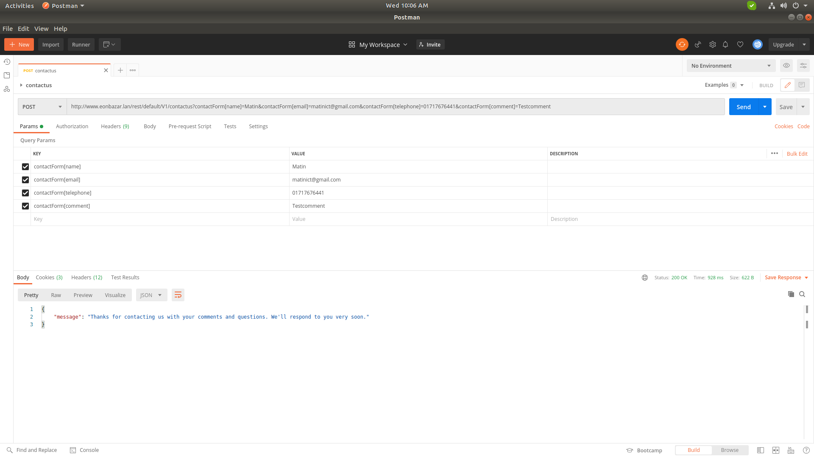

## Magento 2 Web Api EonInfosys_Contact

Magento_Contact Core Module no Api end-Point , this module provide api end point

Methods: Post
Url: http://www.eonbazar.lan/rest/default/V1/contactus?contactForm[name]=Matin&contactForm[email]=matinict@gmail.com&contactForm[telephone]=01717676441&contactForm[comment]=Testcomment

